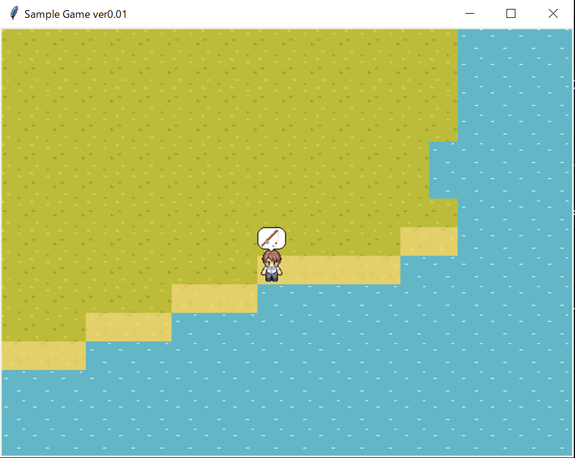

# プログラミング教育のためのゲーム

　卒業研究で「ゲーム開発を通じてPythonプログラミングの基本的な考え方と知識、そして実際の経験とスキルの習得を目的とした教育プログラムの設計・開発」に取り組んでおり、そのために教材として開発しているゲームです。

# 使用言語
Python　3.11.3

# 使用ライブラリ
requirements.txtを参照してください。

# 操作方法
- WASDまたは矢印キーで移動
- Spaceキーで釣り(予定)

# 03/09進捗
釣りアニメーション作成中
